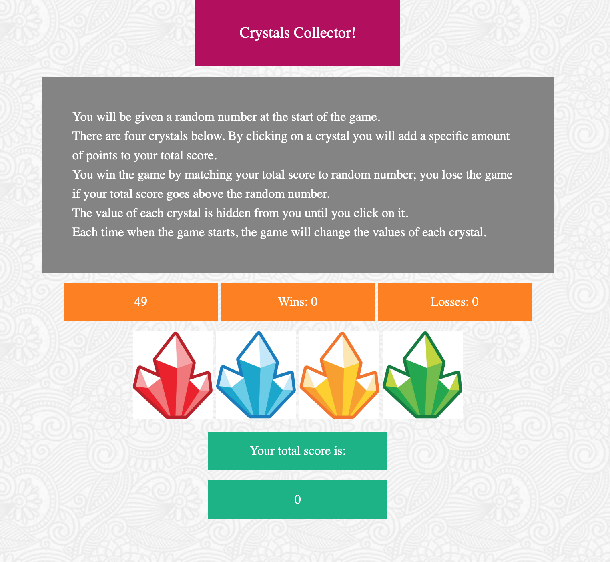

# Crystals-Collector-Game

### What is Crystals Collector Game?
Crystals Collector Game is a front-end web app that capture users' clicks on the crystal images and compare the total scores with the randomly generated number. The app will also count the number of wins and losses based on a certain set of rules. 

### How to play?
Here are the instructions of the game:
- You will be given a random number at the start of the game.
- There are four crystals below. By clicking on a crystal you will add a specific amount of points to your total score.
- You win the game by matching your total score to random number; you lose the game if your total score goes above the random number.
- The value of each crystal is hidden from you until you click on it.
- Each time when the game starts, the game will change the values of each crystal.

### Languages used
- HTML 5
- CSS
- Javascript 

### Contact Information 
Please contact me at: ddzhang2018@gmail.com if you have any questions!

### Deployed Link
https://dzhangcoder.github.io/Crystals-Collector-Game/
